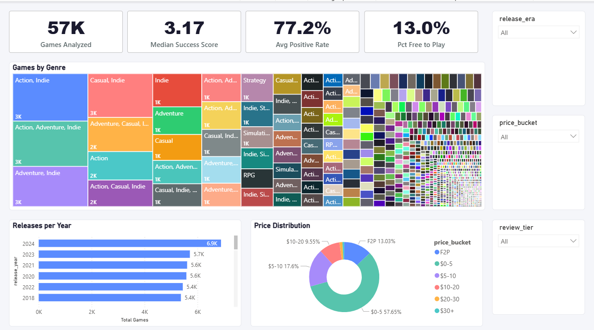
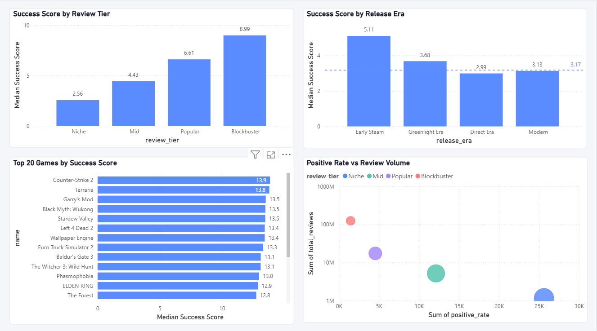
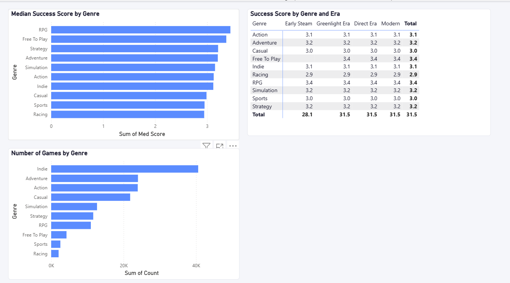
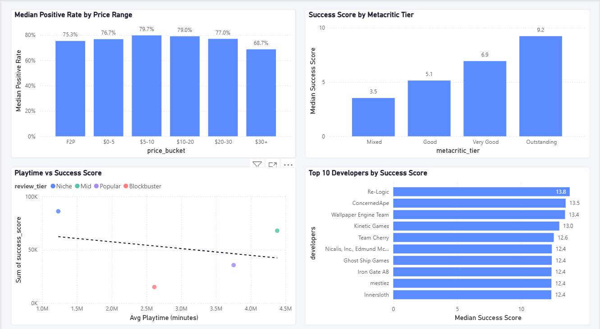

# Steam Games Success Analysis

An end-to-end data analysis project exploring what drives a game's success on Steam, from raw Kaggle and HuggingFace data to a four-page interactive Power BI dashboard.

---

## Objective

Steam hosts over 120,000 games, but only a small fraction of them ever achieve real commercial or critical success. This project digs into pricing, genre, platform support, playtime, and release timing to answer one central question:

> **What measurable factors are associated with a game's success on Steam, and how strong is that relationship really?**

"Success" isn't something you can read directly off the raw data, so I built a composite metric (`success_score`) specifically for this project. More on that below.

---

## Key Insights

| Finding | Detail |
|---|---|
| **Price doesn't signal quality** | Correlation between price and positive review rate is basically zero (r ≈ -0.03) |
| **Reach drives review volume, not satisfaction** | Total reviews and estimated owners are strongly correlated (r = 0.76). Popularity compounds on itself, but that doesn't mean players end up happier |
| **Playtime is a weak predictor of satisfaction** | Average playtime and positive rate show only a weak positive correlation (r = 0.148) |
| **Indie wins on volume, not on quality** | Indie is by far the largest genre (40,581 titles), but Casual games actually post the highest median positive rate (around 82%) |
| **Critics barely show up** | 92.7% of games in the dataset have no Metacritic score at all |
| **The catalog exploded after 2017** | Steam Direct replaced Greenlight and triggered near-exponential growth in yearly releases |
| **Multi-platform games tend to score higher** | Titles supporting Windows, Mac, and Linux show higher median success scores, though this is more likely a sign of studio maturity than something the platforms themselves cause |

---

## Dashboard

A four-page interactive Power BI dashboard built on top of the engineered dataset:

1. **Overview** - catalog-wide KPIs, a genre treemap, the F2P vs. paid split, and the release trend over time
2. **Success Analysis** - top 20 games by success score, score broken down by review tier and release era, and a satisfaction-vs-reach scatter plot
3. **Genre & Platform** - genre performance ranking plus a genre x era success matrix
4. **Price & Playtime** - price bracket vs. satisfaction, playtime vs. success, critic tier comparison, and the top studios by score






---

## Data Sources

| Dataset | Source | Notes |
|---|---|---|
| Steam Games Dataset | [FronkonGames on HuggingFace](https://huggingface.co/datasets/FronkonGames/steam-games-dataset) | About 124,000 games. Loaded through HuggingFace instead of the Kaggle CSV, for a reason explained in the Data Quality Note below |
| Steam Reviews | [andrewmvd on Kaggle](https://www.kaggle.com/datasets/andrewmvd/steam-reviews) | A 500,000-row sample of individual review text and scores |

---

## Project Structure

```
steam_games_success_analysis/
├── data/
│   ├── raw/                      # Original Kaggle exports (not committed, see Reproduce)
│   └── processed/                # Cleaned and feature-engineered outputs
│       ├── games_clean.csv
│       ├── reviews_clean.csv     # excluded from git (153MB), regenerate locally
│       ├── reviews_agg.csv
│       └── df_featured.csv
├── notebooks/
│   ├── 01_data_cleaning.ipynb
│   ├── 02_exploratory_analysis.ipynb
│   └── 03_feature_engineering.ipynb
├── images/                       # Exported chart figures from the EDA
├── dashboard/
│   ├── Steam_Games_Analysis.pbix
│   └── Steam_Analysis_Theme.json
└── README.md
```

---

## Methodology

### 1. Data Cleaning (`01_data_cleaning.ipynb`)
- Removed columns with more than 95% missing values or no real analytical value (URLs, contact info, raw description text)
- Parsed `release_date` into year and month components for the temporal analysis
- Converted `estimated_owners` ranges (things like `"0 - 20000"`) into a usable midpoint integer
- Filled structural nulls in the platform flags (`windows`/`mac`/`linux`) and the playtime fields
- Cleaned the reviews dataset on its own track: dropped rows with null review text, converted `review_score` into a boolean sentiment flag, and aggregated everything down to one row per game (`review_count`, `positive_rate_rev`, `helpful_rate`, `avg_review_length`)

### 2. Exploratory Data Analysis (`02_exploratory_analysis.ipynb`)
Five sections, each with a written interpretation sitting right next to the chart:
- **Distributions** - price, review volume, and positive rate, all right-skewed enough to need log scales
- **Temporal trends** - release growth, seasonality, and a year x month heatmap
- **Genre analysis** - volume vs. quality by genre, using an exploded long-format transformation since games can carry multiple genres
- **Correlations** - how price, playtime, reviews, and ownership relate to each other
- **Platform support** - whether multi-platform availability actually moves the needle on reach and reception

### 3. Feature Engineering (`03_feature_engineering.ipynb`)
This is where the analytical layer for the dashboard gets built. See the Key Metric section below and the feature table further down.

### 4. Dashboard (Power BI)
Connects straight to the feature-engineered dataset through a Python script data source (this sidesteps the CSV parsing headaches caused by nested, multi-value text fields), with DAX measures for every KPI and a custom report theme for consistent styling.

---

## Key Metric: `success_score`

Nothing in the raw data directly represents "success." A game with a 90% positive rate and 10 reviews isn't in the same league as one with a 90% positive rate and 500,000 reviews, even though the ratio looks identical on paper.

```
success_score = positive_rate × log(1 + total_reviews)
```

The log transform on review volume rewards games that have built a real audience, without letting a handful of blockbuster titles completely dominate the scale. This score ends up being the main ranking metric across the whole dashboard.

---

## Engineered Features

| Feature | Type | Purpose |
|---|---|---|
| `success_score` | Float | Composite KPI combining review quality and volume |
| `price_bucket` | Category | Price segmentation (F2P, $0-5, $5-10, $10-20, $20-30, $30+) |
| `review_tier` | Category | Game size by review volume (Niche, Mid, Popular, Blockbuster) |
| `release_era` | Category | Steam platform era (Early Steam, Greenlight, Direct, Modern) |
| `metacritic_tier` | Category | Human-readable critic score grouping, isolates the 92.7% with no score at all |
| `is_free` / `is_multiplatform` | Binary | Quick filters for F2P and cross-platform titles |
| `playtime_capped` | Float | Average playtime with a 99th-percentile cap to remove a handful of clearly erroneous outliers |
| `genre_*` | Binary (x10) | One-hot flags for the top 10 genres, so the dashboard never has to parse strings at query time |

---

## Data Quality Note

The Kaggle CSV export of the FronkonGames Steam dataset has a corrupted `Positive` column. Values are capped at 100 no matter how many reviews a game actually has, which quietly produces misleading results in any metric built on top of it. I caught this by sanity-checking the top games against titles I knew should have millions of reviews, like CS:GO and Dota 2, and the numbers just didn't add up.

The fix was loading the same dataset from its [HuggingFace mirror](https://huggingface.co/datasets/FronkonGames/steam-games-dataset) using the `datasets` library, which preserves the correct values. Worth flagging here as a reminder that "complete" data and "correct" data aren't the same thing. Always sanity-check your numbers against something you already know to be true before building metrics on top of them.

---

## Tech Stack

- **Python** with pandas, numpy, matplotlib, and seaborn
- **Jupyter Notebook**, run inside a dedicated conda environment (`steam_games_analysis`)
- **Power BI Desktop**, with DAX measures, a custom report theme, and a Python-script data source
- **Data sources** through Kaggle and the HuggingFace `datasets` library

---

## Reproduce This Project

```bash
# 1. Create the environment
conda create -n steam_games_analysis python=3.11 pandas numpy matplotlib seaborn jupyter datasets
conda activate steam_games_analysis

# 2. Download the reviews dataset
# https://www.kaggle.com/datasets/andrewmvd/steam-reviews -> data/raw/dataset.csv
# (the games dataset loads directly from HuggingFace inside the notebook, no manual download needed)

# 3. Run the notebooks in order
jupyter notebook notebooks/01_data_cleaning.ipynb
jupyter notebook notebooks/02_exploratory_analysis.ipynb
jupyter notebook notebooks/03_feature_engineering.ipynb

# 4. Open the dashboard
# dashboard/Steam_Games_Analysis.pbix in Power BI Desktop
# Update the Python script data source path to point at your local data/processed/df_featured.csv
```

> `reviews_clean.csv` goes over GitHub's 100MB limit, so it's excluded through `.gitignore`. It regenerates automatically the moment you run `01_data_cleaning.ipynb`.

---

## Limitations & Future Work

- The reviews dataset is a 500,000-row sample, not the full Steam Reviews corpus, so anything derived from review text (`positive_rate_rev`, `helpful_rate`) only really covers the most-reviewed slice of the catalog
- `success_score` is a heuristic I designed for this project, not a validated model. A natural next step would be testing it against an independent definition of success, like revenue estimates if those become available
- The genre and platform patterns found here are correlational, not causal. Multi-platform support lining up with higher scores probably says more about studio quality and budget than about the platforms themselves
- A good extension would be a predictive model (regression or gradient boosting) estimating `success_score` from pre-release features only, like price, genre, and planned platform support. That would turn this into more of a pre-launch decision-support tool

---

## Author

**Edwin**, Systems Engineer from Universidad Fidélitas (2022-2026), specializing in Data Analysis and Artificial Intelligence.

Built as a portfolio project while applying for Data Analyst roles in Costa Rica and remotely.